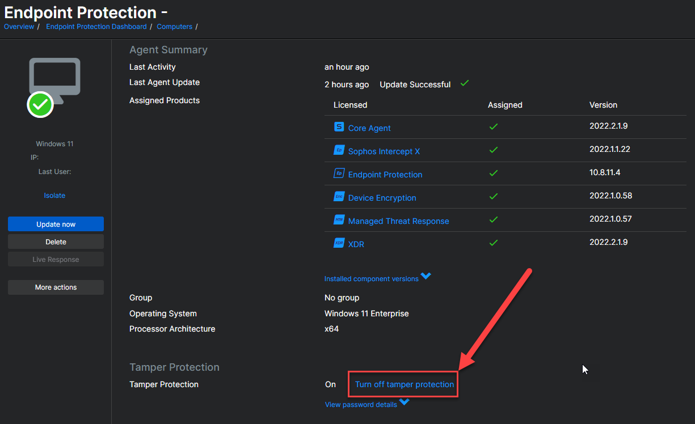
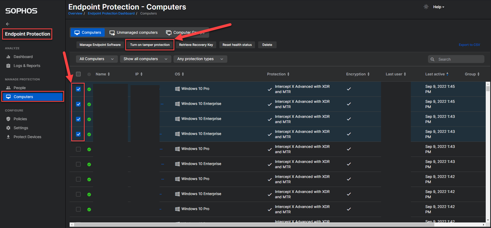
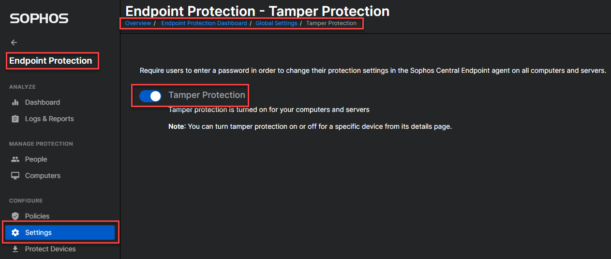

# Description

# Instructions

1. Disable tamper protection for device(s) in Sophos Central
   1. Single machine
      1. Open machine in Sophos Central and disable Tamper Protection
   2. Multi-machine
      1. Open list of computers in Sophos Central, tick the checkbox next to the computer's name, and press the "Turn off tamper protection button
   3. Entire tenant/organization
      1. Navigate to `Endpoint Protection > Settings > Global Settings > Tamper Protection`
      2. Toggle `Tamper Protection` to the `Off` position

**Single machine**

**Multi-machine**

**Entire tenant/organization**

2. Open an elevated `Powershell` window
3. Run `sophos_run_cli_unins.ps1`
   1. Can be scheduled as an `Intune`/`SCCM` job
4. **Note**: Uninstall happens immediately, but machines should still be rebooted